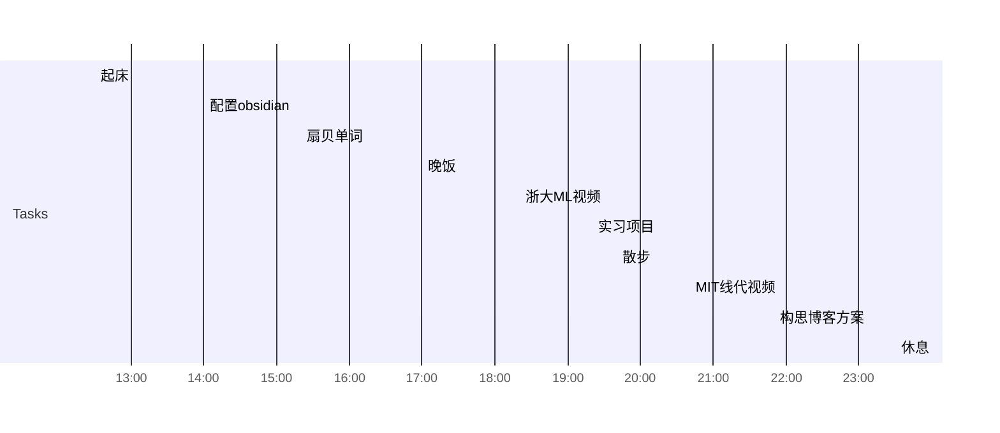
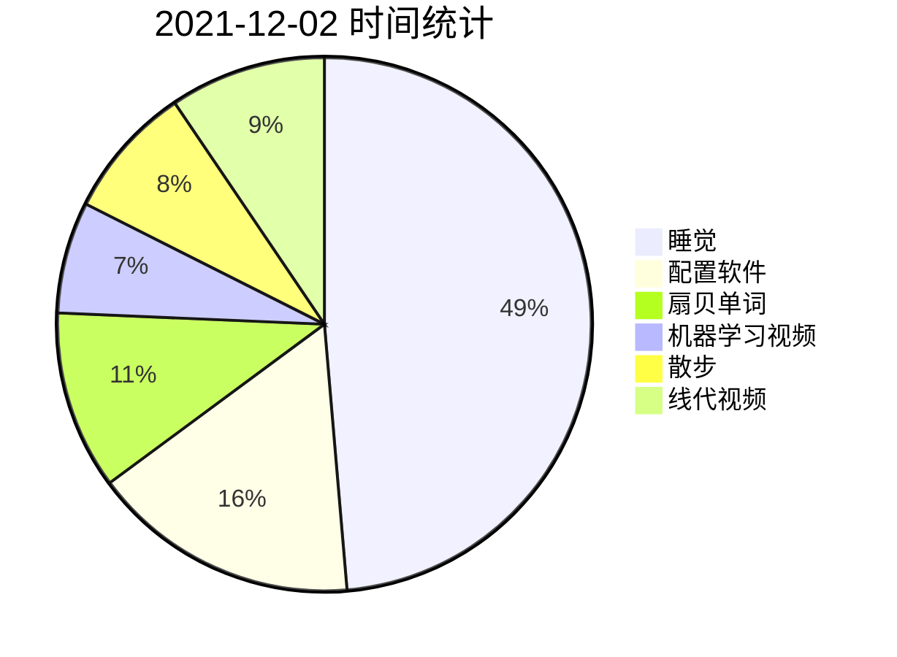

## Day Planner

### 日计划

#### 早

- [x] 12:30 起床

#### 中

- [x] 14:00 配置obsidian
- [x] 15:20 扇贝单词
- [x] 17:00 晚饭

#### 晚

- [x] 18:20 浙大ML视频
	- [x] 做笔记[21-人工智能的第一次寒冬](21-人工智能的第一次寒冬.md)[22-多层神经网络](22-多层神经网络.md)[23-三层神经网络可以模拟所有的决策面](23-三层神经网络可以模拟所有的决策面.md)
- [x] 19:20 实习项目
	- [ ] 完善文档[HAR预测金融数据波动率](HAR预测金融数据波动率.md)，整理下一步思路
- [x] 19:40 散步
- [x] 20:40 MIT线代视频
	- [x] 做笔记[Lec07_AX=0：主变量、特解](Lec07_AX=0：主变量、特解.md)
- [ ] 21:50 构思博客方案
	- [ ] Github Pages + Docsify + Obsidian
- [ ] 李航《统计学习方法》
- [ ] 23:30 休息

### 统计信息

