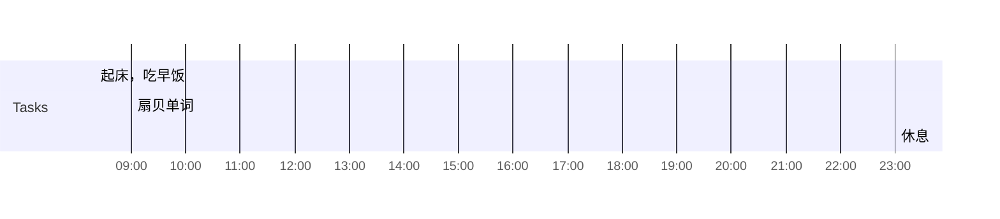
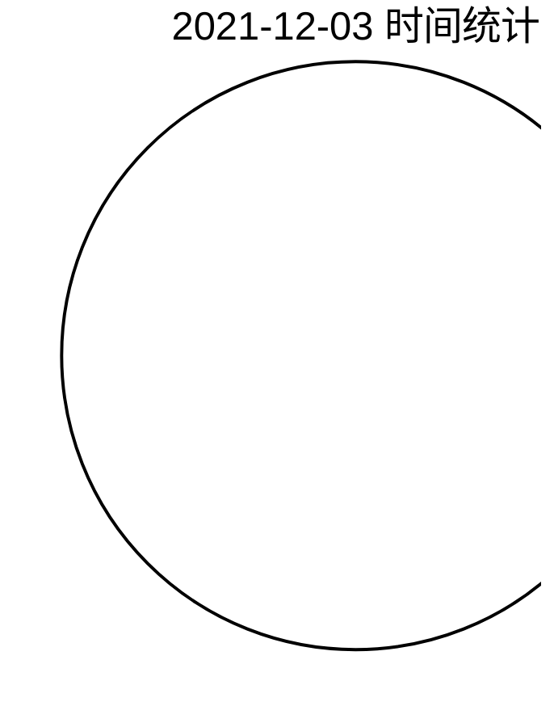

## Day Planner

```mermaid
gantt
    dateFormat  HH-mm
    axisFormat %H:%M
    %% Current Time: 上午8:26:21
    section Tasks
    起床，吃早饭     :08-20, 40mm
    扇贝单词     :09-00, 840mm
    休息     :23-00, 0mm
    section Breaks

```

### 日计划

#### 早

- [ ] 08:20 起床，吃早饭
- [ ] 09:00 扇贝单词

#### 中

- [ ]

#### 晚

- [ ]

- [ ] 23:00 休息

### 统计信息

```mermaid
pie
	title 2021-12-03 时间统计
	
```