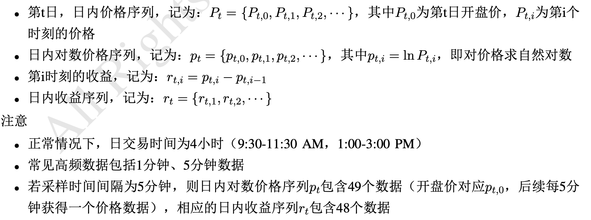
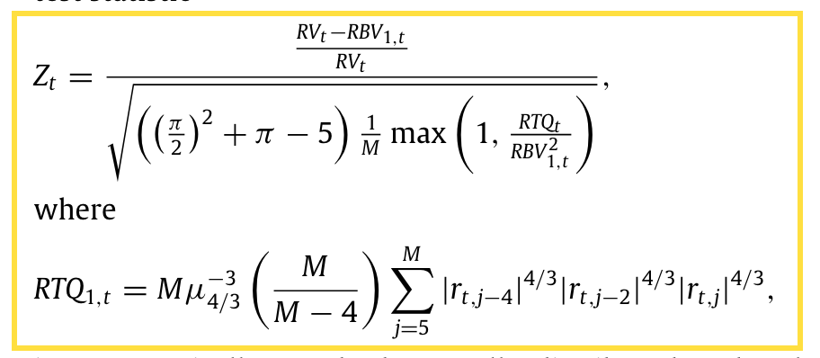
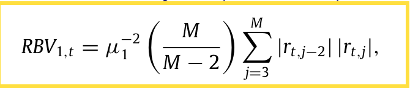
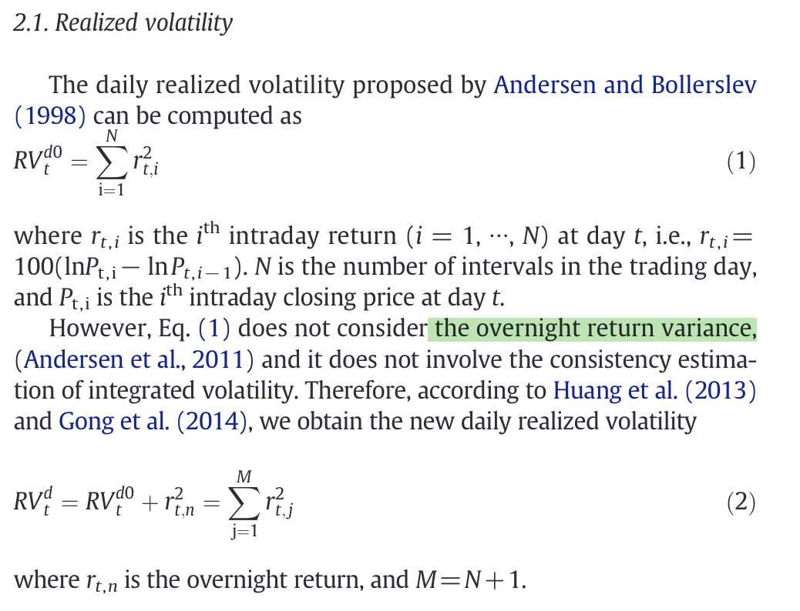
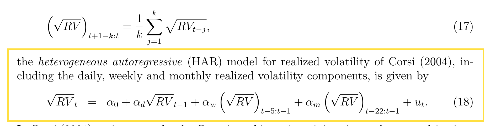
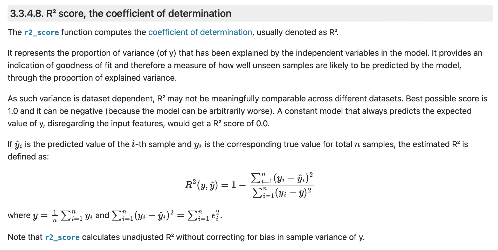
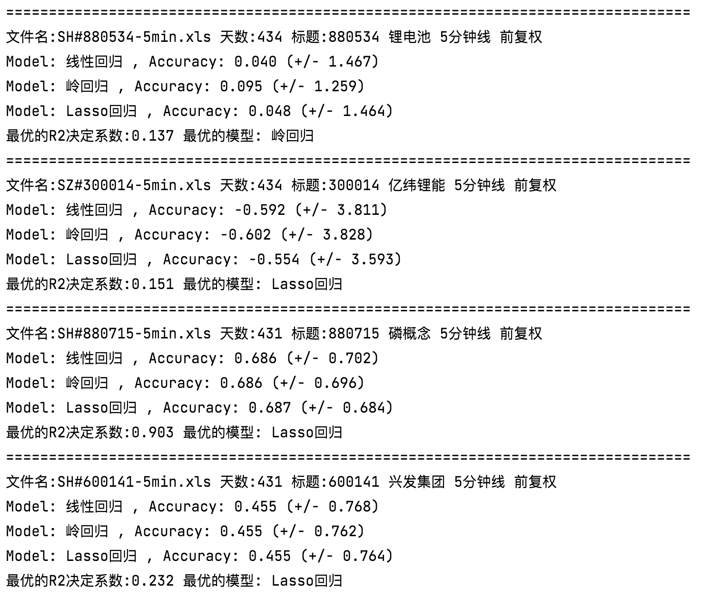

# HAR模型预测股票收益波动率


## 项目描述

使用**HAR-type volatility models**来预测金融数据的波动率，并测试评估其预测性能。HAR-type volatility models指的是 *论文[1]* 中汇总的一系列线性模型。

采用金融数据（即预测对象）粗略地分为两类，一种是个股，另一种“综合性”标的物，如ETF基金、板块指数等。

- ETF基金：交易所交易型基金（Exchange Traded Funds），在场内像股票一样交易的基金。
- 指数：多只股票的加权平均，是一个股票组合。
- 板块：一些具有相同特征的股票的集合。

## 逻辑架构

1. 从原始数据集中提取出我们关心的特征，主要是参考 *论文[1]* 中的5种 **Volatility components** 。
2. 定义不同的HAR-type volatility model，生成相应的训练/测试数据集。
3. 使用 *论文[1]* 中的预测评估方法 **rolling window prediction method** ，采用回归算法训练，计算不同 HAR-type volatility model 的R2决定系数来评估预测表现。

大致可以看作，第1步是数据集处理和特征工程，第2步是算法模型，第3步是目标函数和评估指标。文档中不包括数据获取部分。

## 特征工程

### 价格序列、收益序列的计算

通过金融数据的价格序列，计算其价格序列和对数收益序列，是计算波动率序列的前置准备。

假设数据集按照相同的时间间隔$\Delta$采样，日内价格序列的长度为 $M=240/\Delta+1$ ，收益序列的长度为 $N=M-1$ 。

> 在下图中，若采样间隔为5分钟，则 $\Delta=5,M=240/5+1=49,N=48$ 。
>
> 

参考 *论文[1]* 对隔夜收益和日内收益的计算公式做如下改动：

- **隔夜收益**（*overnight return variance*）

$$
\mathcal r_{(t,0)}=r_{(t,n)}=100(lnP_{t,0}-lnP_{t-1,N})
$$
- **日内收益**（$i^{th}$ intraday return at day t）

$$
\mathcal r_{t,i}=100(lnP_{t,i}-lnP_{t,i-1}))\ ,\quad i=1,\ldots,N
$$

### Volatility components的计算

这一步是进一步提取出我们关心的特征，即特征工程，主要参考的是*论文[1]*中的5种 Volatility components。

==待实现== 解释变量的选择/增加，是否具有明确的金融学意义，例如交易量对波动率的影响。

1. **日波动率成分**（daily realized volatility）

$$
RV_t^d=RV_t^{d0}+r^2_{(t,0)}
\\
RV_t^{d0}=\sum_{i=1}^N{r^2_{t,i}}
$$

2. **跳变成分**（daily discontinuous jump variation）和**连续成分**（daily continuous sample path variation）

$$
J_t^d=I(Z_t>\phi(\alpha))(RV_t-RBV_t)
\\
C_t^d=I(Z_t\leq \phi(\alpha))RV_t+I(Z_t> \phi(\alpha))RBV_t
$$
> $\phi(\alpha)$ : the appropriate critical value from the standard normal distribution, $\alpha=0.99$.

> *论文[1] [4]* 对数学符号 $Z_t,\ RBV_t$ 的计算公式解释存在错误，*论文[3]* 中的公式纠正了这一点。
>
> 
>
> 

3. **半方差成分**（Realized semivariance）

$$
RSV_t^{d+}=\sum_{j=1}^{M}\{r_{t,j}\geq 0\}r_{t,j}^2
\\
RSV_t^{d-}=\sum_{j=1}^{M}\{r_{t,j}< 0\}r_{t,j}^2
$$

> ==问题== 这一步是否加入了隔夜收益？因为累加的上限是M，而对数收益序列的长度是N，但 *论文[1]* 中写的比较模糊。$r_{t,M}$和$r_{t,n}$是否是等价的？如果是，在半方差成分的计算代码中还要加入隔夜收益。
>
> 

4. **带符号的跳变成分**（Signed jump）

$$
SJ_t^d=RSV_t^{d+}-RSV_t^{d-}
$$

5. **带符号的半跳变成分**（Signed semi-jump）

$$
SSJ_t^{d+}=I\{SJ_t^d\geq0\}SJ_t^d
\\
SSJ_t^{d-}=I\{SJ_t^d<0\}SJ_t^d
$$

## 算法模型

### *论文[1]*中的16种HAR-type volatility models（代码已实现8种）

> ==问题== 关于波动率 $RV_t^d$计算是否要开方？这一点还有待确认。 *论文[5]* 中给出有别与 *论文[1]*的模型：
>
> 
>
> 现在版本的代码中，默认为开方的形式，加上
> $$
> RV_t^d = \sqrt{RV_t^d}
> $$
> 

1. HAR-RV model

$$
RV^d_{t+1}=c+\alpha_1RV_t^d+\alpha_2RV_t^w+\alpha_3RV_t^m+\epsilon_{t+1}
$$

2. HAR-RV-J model

$$
RV^d_{t+1}=c+\alpha_1RV_t^d+\alpha_2RV_t^w+\alpha_3RV_t^m+\beta_1J^d_t+\epsilon_{t+1}
$$

3. HAR-CJ model

$$
RV^d_{t+1}=c+\alpha_1RV_t^d+\alpha_2RV_t^w+\alpha_3RV_t^m
+\beta_1J^d_t+\beta_2J^w_t+\beta_3J^m_t+\epsilon_{t+1}
$$

4. HAR-RSV model

$$
RV^d_{t+1}=c+\alpha_1RSV_t^{d+}+\alpha_2RSV_t^{w+}+\alpha_3RSV_t^{m+}\\
+\beta_1RSV_t^{d-}+\beta_2RSV_t^{w-}+\beta_3RSV_t^{m-}+\epsilon_{t+1}
$$

5. HAR-RSV-J model

$$
RV^d_{t+1}=c+\alpha_1RSV_t^{d+}+\alpha_2RSV_t^{w+}+\alpha_3RSV_t^{m+}\\
+\beta_1RSV_t^{d-}+\beta_2RSV_t^{w-}+\beta_3RSV_t^{m-}
+\phi_1J^d_t+\epsilon_{t+1}
$$

6. HAR-RV-SJ model

$$
RV^d_{t+1}=c+\alpha_1RV_t^d+\alpha_2RV_t^w+\alpha_3RV_t^m+\beta_1SJ^d_t+\epsilon_{t+1}
$$

7. HAR-RV-SSJ(1) model

$$
RV^d_{t+1}=c+\alpha_1RV_t^d+\alpha_2RV_t^w+\alpha_3RV_t^m
+\beta_1SSJ^{d+}_t+\phi_1SSJ^{d-}_t+\epsilon_{t+1}
$$

8. HAR-RV-SSJ(2) model

$$
RV^d_{t+1}=c+\alpha_1RV_t^d+\alpha_2RV_t^w+\alpha_3RV_t^m
+\beta_1SSJ^{d+}_t+\beta_2SSJ^{w+}_t+\beta_3SSJ^{m+}_t\\
+\phi_1SSJ^{d-}_t+\phi_2SSJ^{w-}_t+\phi_3SSJ^{m-}_t+\epsilon_{t+1}
$$

### 库函数scikit-learn中的3种回归算法

线性模型的学习算法使用的是[scikit-learn.linear_model](https://scikit-learn.org/stable/modules/linear_model.html)中的三种，分别是线性回归、Lasso回归、岭回归。

1. 线性回归目标函数

$$
J(β)=∑(y−Xβ)^2
$$
2. Lasso回归目标函数，惩罚项为L1范数。其中 $E S S ( β )$ 表示误差平方和，$\lambda l_1(\beta)$表示惩罚项

$$
J(β)=∑(y−Xβ)^2+λ\Vertβ\Vert_1\\
=∑(y−Xβ)^2+∑λ\vertβ\vert\\
=ESS(\beta)+\lambda l_1(\beta)
$$
3. 岭回归目标函数，惩罚项为L2范数

$$
J(β)=∑(y−Xβ)^2+λ\Vertβ\Vert_2^2\\
=∑(y−Xβ)^2+∑λβ^2
$$

## 预测评估

### 预测评估方法：滚动窗口 （rolling window prediction method）

用长度为L的滑动窗口作为训练集，会得到滑动窗口后一天$RV_t^d$的预测值。

具体来说，假设滑动窗口内的**波动率分量序列**为$\{RV_{t-L+1},\ldots,RV_t\}$，用该序列来训练HAR模型，然后将$RV_t$输入训练后的模型来预测$\widehat{RV}_{t+1}^d$。

其中t的取值范围是 $ \{ L\le t\le N-1,t\in N^+\}$ ，N是波动率序列的长度，获得了波动率预测值序列 $\{\widehat{RV}_{L+1}^d,\ldots,\widehat{RV}_N^d\}$ 。 

那么假设数据集的大小为N，我们就会获得N-L个预测样本。

然后将**波动率预测值序列**和**真实的波动率序列**带入**R2决定系数的计算公式**，用于模型性能评估。

*论文[2]* 中的实验，数据集的大小为4766，2500用于训练模型，滑动窗口的大小约为其数据集大小的一半。

==待实现== 考虑选择更多滑动窗口大小 window_size ，观察不同的 window_size 对预测性能的影响。

### 性能评估指标：R2决定系数

1. 代码里采用的R2决定系数，是 *sklearn.linear_model.LinearRegression.score* 函数计算实现的，满足标准的定义。

> scikit-learn官方文档对R2决定系数的定义如下图，更多见[sklearn.metrics.r2_score](https://scikit-learn.org/stable/modules/generated/sklearn.metrics.r2_score.html#sklearn.metrics.r2_score)。
>
> 

2. ==待实现== 对于预测结果的分析，考虑对趋势判断的正确性（分类问题：涨/跌）

### 结果可视化

1. 测试集数据（含日期）的：真实波动率、预测波动率、误差（百分比），纵坐标从0开始不缩放，两张子图共享同一横坐标。


## 更早版本文档和代码的问题

### 评分估计的95%置信区间（只适用于方案c）

> 训练集与测试集如何划分？
>
> **方案c.** 随机划分（测试集可能在样本中段），保留一定的时间粒度，如以周为单位（连续5日）。
>
> **方案c**，选取周为单位时，用评分估计的平均得分和95%置信区间可发现，R2决定系数的**方差非常大**，模型不稳定；
>
> 

在测试方案c中，k-fold交叉验证会得到一个score序列，采用的指标同样是R2决定系数。

```python
# k-fold + 95%置信区间
def k_fold(models, X, y):
    cv = ShuffleSplit(n_splits=10, test_size=5, random_state=0)
    for type, model in models:
        scores = cross_val_score(model, X, y, cv=cv, scoring='r2')
        print("Model:", type, ", Accuracy: %0.3f (+/- %0.3f)" % (scores.mean(), scores.std() * 2))
```

置信区间的计算公式：
$$
[  \mu-1.96*\frac{\sigma}{\sqrt{n}},\  \mu+1.96*\frac{\sigma}{\sqrt{n}}]
$$
$\sigma$是score序列的标准差，$\mu$是score序列的均值，n为一次实验样本数量。

评分估计的95%置信区间是因为k-fold交叉验证等价于进行了k次实验，每次实验的样本数量n在之前版本的代码中取了$n=1$ 。**现在看来n的取值可能存在问题？**


## 论文引用

[1] Forecasting the volatility of crude oil futures using HAR-type models with structural breaks

[2] 2012 _HAR modeling for RV forecasting Chap15 Handbook

[3] A reduced form framework for modeling volatility of speculative prices based on realized variation measures

[4] Forecasting Return Volatility of the CSI 300 Index Using the Stochastic Volatility Model with Continuous Volatility and Jumps

[5] The volatility of realized volatility


