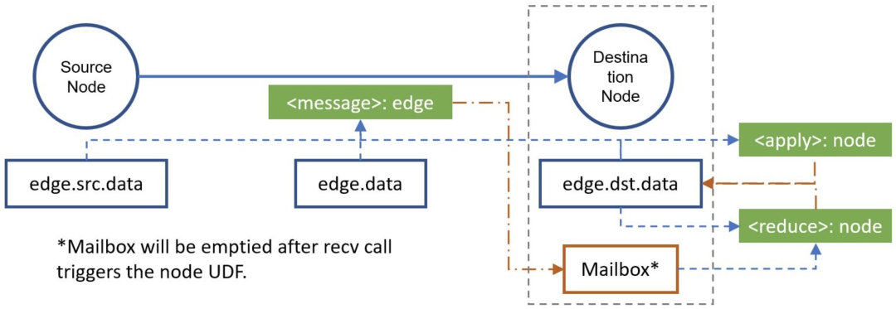

## 相关阅读

1. [GNN教程：DGL框架实现GCN算法！](https://blog.csdn.net/Datawhale/article/details/111465624)

图神经网络的计算模式大致相似，节点的Embedding需要汇聚其邻接节点Embedding以更新

- 从线性代数的角度来看，这就是邻接矩阵和特征矩阵相乘。然而邻接矩阵通常都会很大
- 另一种计算方法是将邻居的Embedding传递到当前节点上，再进行更新。

DGL 的核心为消息传递机制（message passing），主要分为消息函数 （message function）和汇聚函数（reduce function）。

- 消息函数（message function）：传递消息的目的是将节点计算时需要的信息传递给它，因此对每条边来说，每个源节点将会将自身的Embedding（e.src.data）和边的Embedding(edge.data)传递到目的节点；对于每个目的节点来说，它可能会受到多个源节点传过来的消息，它会将这些消息存储在"邮箱"中。
- 汇聚函数（reduce function）：汇聚函数的目的是根据邻居传过来的消息更新跟新自身节点Embedding，对每个节点来说，它先从邮箱（v.mailbox['m']）中汇聚消息函数所传递过来的消息（message），并清空邮箱（v.mailbox['m']）内消息；然后该节点结合汇聚后的结果和该节点原Embedding，更新节点Embedding。

2. [【Code】关于 GCN，我有三种写法](https://zhuanlan.zhihu.com/p/139359188)

全面。

