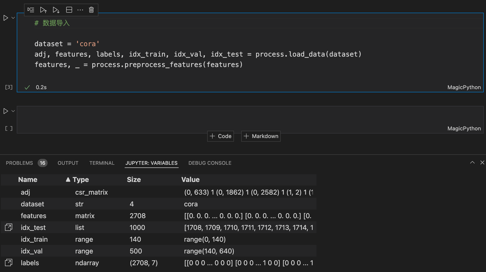
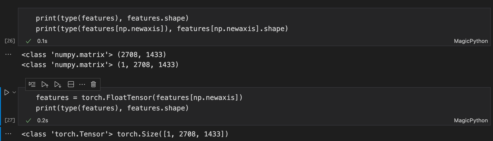
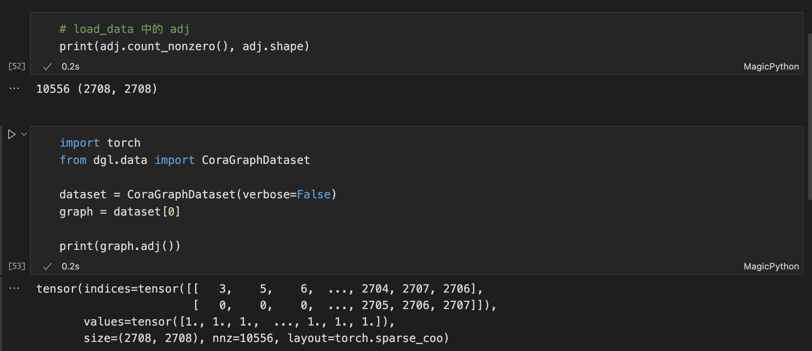
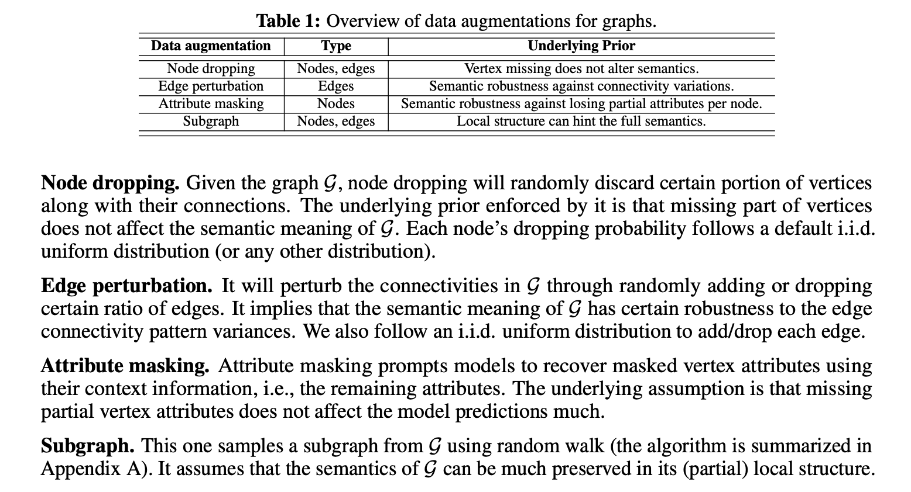
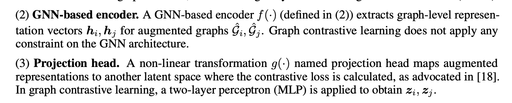
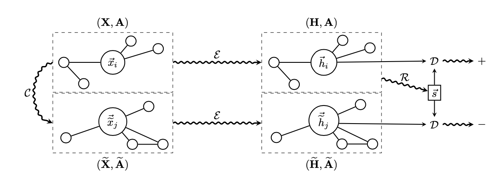

# GraphCL代码解读｜unsupervised_Cora

## 为什么写这篇文章？

在尝试用DGL框架复现GraphCL时，在网络上没有找到可以参考的资源，结果还是要先通过解读paper原本的Github代码，加强对模型的理解，再在后续根据所学对各个模块做相应的替换。

## 文章关注什么？

1. GraphCL的代码实现，是按照paper中提出的理论的，将数学模型与代码实现一一对应，提高动手能力。
2. 解读的代码中用到了scipy.sparse（稀疏矩阵）等相应库函数，在解读及复现的过程中一一熟悉。
3. 理清代码不同模块间的数据流，到底是什么数据类型，是什么Size的，类型转换怎么做？

## 代码的模块划分

GraphCL是通过自监督学习，推断出节点/图的表示，再用在下流任务中。

在UNSUPERVISED_CORA这个节点分类任务中，要训练的模型包括GraphCL和LogReg两部分，前者（GraphCL）的输出是后者（LogReg）的输入，所以第一步将代码分为这样前后两个模块。

GraphCL具体包括：

- 数据的导入：Cora数据集导入，包含临界矩阵、特征、训练/验证/测试节点的序号、标签。
- 数据的处理：四种数据增强方法（node dropping, edge perturbation, subgraph, attribute masking）
- 模型的定义：GraphCL主题（对应代码中的DGI）、编码器（对应GCN）、read out函数（获得图表示）、鉴别器（对比学习：计算正负样本之间的距离）。
- 模型的训练：损失函数的定义、自定义label的设置、负样本的生成、早停止等技术、获得最后的结果（节点/图的嵌入表示）。

LogReg部分较为常规，就是一个简单的拿特征多分类的任务，完全与图无关，不做介绍。

本文的重点放在GraphCL模块。

## GraphCL模块

### Cora数据导入

先不看`process.load_data`这个函数的具体实现，单就其输出而言，来分析它的功能。

可以看到数据经过`load`和`preprocess`两个步骤后，呈现出变量的Type和Size。

`adj`是邻接矩阵，数据类型是`csr_matrix`，这是`scipy.sparse`模块提供的稀疏矩阵类型，全名为Compressed Sparse Row matrix，即按行压缩的稀疏矩阵。除此之外还有CSC，按列压缩的稀疏矩阵。

在下面`adj`的Value，存储的格式是`(row, col) data`的重复，只存储了非零元素，但实际上`CSR`的内部并不是这样存储的，这中形式是**Coordinate Format (COO)**的存储格式，更多详细内容可看[这篇博客](https://blog.csdn.net/weixin_36001351/article/details/72563804)。

至于`features`的类型`matrix`是`numpy.matrix`，具有常见矩阵类的一切方法和属性，不做更多介绍，详细见[官方文档传送门](https://numpy.org/doc/stable/reference/generated/numpy.matrix.html)。



下列代码在`execute.py`中数据导入所有内容，1-2行刚刚已经介绍过了，4-6行的意思如字面所示，只需要注意一点`labels`采用的是one-hot编码即可。

```python
adj, features, labels, idx_train, idx_val, idx_test = process.load_data(dataset)
features, _ = process.preprocess_features(features)

nb_nodes = features.shape[0]  # node number
ft_size = features.shape[1]   # node features dim
nb_classes = labels.shape[1]  # classes = 6

features = torch.FloatTensor(features[np.newaxis])
```

而第8行，对features的Type和Size做了变换，在下图中很清晰的展示了出来，`np.newaxis`是`numpy`中用来新增维度的。



主题部分已经说完了，那么回过头去到第一步，Cora数据集的`load_data`函数和`preprocess_features`函数，我们关心两点，它实现了什么功能？具体方法是什么？

两个函数的定义在`process.py`这个文件中，先简单的将其单独拎出来看。

这是`load_data`函数，输入是数据集的名字，输出是`adj, features, labels, idx_train, idx_val, idx_test `这么一串东西，功能是从本地的`data`文件夹中读入了数据，并转化成了需要的数据形式。

```python
def load_data(dataset_str): # {'pubmed', 'citeseer', 'cora'}
    """Load data."""
    names = ['x', 'y', 'tx', 'ty', 'allx', 'ally', 'graph']
    objects = []
    for i in range(len(names)):
        with open("data/ind.{}.{}".format(dataset_str, names[i]), 'rb') as f:
            if sys.version_info > (3, 0):
                objects.append(pkl.load(f, encoding='latin1'))
            else:
                objects.append(pkl.load(f))

    x, y, tx, ty, allx, ally, graph = tuple(objects)
    test_idx_reorder = parse_index_file("data/ind.{}.test.index".format(dataset_str))
    test_idx_range = np.sort(test_idx_reorder)

    if dataset_str == 'citeseer':
        # Fix citeseer dataset (there are some isolated nodes in the graph)
        # Find isolated nodes, add them as zero-vecs into the right position
        test_idx_range_full = range(min(test_idx_reorder), max(test_idx_reorder)+1)
        tx_extended = sp.lil_matrix((len(test_idx_range_full), x.shape[1]))
        tx_extended[test_idx_range-min(test_idx_range), :] = tx
        tx = tx_extended
        ty_extended = np.zeros((len(test_idx_range_full), y.shape[1]))
        ty_extended[test_idx_range-min(test_idx_range), :] = ty
        ty = ty_extended

    features = sp.vstack((allx, tx)).tolil()
    features[test_idx_reorder, :] = features[test_idx_range, :]
    adj = nx.adjacency_matrix(nx.from_dict_of_lists(graph))

    labels = np.vstack((ally, ty))
    labels[test_idx_reorder, :] = labels[test_idx_range, :]

    idx_test = test_idx_range.tolist()
    idx_train = range(len(y))
    idx_val = range(len(y), len(y)+500)

    return adj, features, labels, idx_train, idx_val, idx_test 
```

这个函数看着就让人头大，我选择不看。

因为我想到了`DGL`中的`CoraGraphDataset`函数，它们都是Cora数据集，导入的数据相比是与其一致，没有必要因为这糟糕的数据存储方式浪费精力。

于是乎我做了验证，在下图中可以看到，`size`和`nonzero`两个属性是相等的，虽然具体节点序号不一样（太长了没有打印出来），但基本上可以确认他们就是同一个数据集，是可以等效替换的。



至于`preprocess_features`函数，功能是**行归一化**，并返回两种格式（dense和sparse）的特征矩阵。

```python
def preprocess_features(features):
    """Row-normalize feature matrix and convert to tuple representation"""
    rowsum = np.array(features.sum(1))
    r_inv = np.power(rowsum, -1).flatten()
    r_inv[np.isinf(r_inv)] = 0.
    r_mat_inv = sp.diags(r_inv)
    features = r_mat_inv.dot(features)
    return features.todense(), sparse_to_tuple(features) 
```

上面的代码一连串矩阵计算，本质上就是将节点的每个特征值除以它们的特征和，即让一个节点的特征向量中的每个值和为一。

尝试用DGL中的`apply_node`函数实现相同的功能。

```python
def norm_nodes(nodes):
    "节点特征归一化"
    feat = nodes.data['feat']
    sum = feat.sum(1)
    inv = 1. / sum
    inv[torch.isinf(inv)] = 0.
    norm = torch.mm(torch.diag(inv), feat)
    return {'norm': norm}

graph.apply_nodes(norm_nodes)
```

并且验证两者是否是一致的，通过这里的输出可以证实数据一一对应，函数实现了相同的功能。

```python
# 验证自己实现的apply_node函数效果是否与参考代码一致
norm1 = preprocess_features(feat)
norm2 = graph.ndata['norm']
print(norm1, norm2, (norm1!=np.array(norm2)).sum())
```

于是乎，数据的导入的部分就完成了，用`dgl.data.CoraGraphDataset`替换了原本代码从本地读入的数据，并且复现了“节点特征归一化”这一功能，汇总后如下所示。

```python
import torch
from dgl.data import CoraGraphDataset
import scipy.sparse as sp

dataset = CoraGraphDataset()
graph = dataset[0]

def norm_nodes(nodes):
    "节点特征归一化"
    feat = nodes.data['feat']
    sum = feat.sum(1)
    inv = 1. / sum
    inv[torch.isinf(inv)] = 0.
    norm = torch.mm(torch.diag(inv), feat)
    return {'norm': norm}

graph.apply_nodes(norm_nodes)

label = graph.ndata['label']
print('label shape:', label.shape, label) # 不是one-hot编码

train_mask = graph.ndata['train_mask']
val_mask = graph.ndata['val_mask']
test_mask = graph.ndata['test_mask']

train_idx = graph.nodes()[train_mask]
val_idx = graph.nodes()[val_mask]
test_idx = graph.nodes()[test_mask]

num_nodes = graph.number_of_nodes()
num_feats = feat.shape[1]
num_classes = dataset.num_classes 

feat = graph.ndata['norm']
adj = graph.adj(scipy_fmt='csr')
```

### 图数据增强（Graph Data Augmentation）方法 

论文中提到的四种图数据增强方法：



论文代码中实现的文件为`aug.py`，四种增强方法的功能很明确，问题是我们应该如何实现它们？

**Node dropping**

首先是`aug_drop_node`函数，这里的代码没什么难点，看过去基本都能明白，先是涉及到了数据类型和`Size`的变换，再是从所有节点中采样需要删除的节点列表，调用`delete_row_col`函数从特征和邻接矩阵中删除它们后，再转换回对应的数据类型和`Size`。

```python
def aug_drop_node(input_fea, input_adj, drop_percent=0.2):

    input_adj = torch.tensor(input_adj.todense().tolist())
    input_fea = input_fea.squeeze(0)

    node_num = input_fea.shape[0]
    drop_num = int(node_num * drop_percent)    # number of drop nodes
    all_node_list = [i for i in range(node_num)]

    drop_node_list = sorted(random.sample(all_node_list, drop_num))

    aug_input_fea = delete_row_col(input_fea, drop_node_list, only_row=True)
    aug_input_adj = delete_row_col(input_adj, drop_node_list)

    aug_input_fea = aug_input_fea.unsqueeze(0)
    aug_input_adj = sp.csr_matrix(np.matrix(aug_input_adj))

    return aug_input_fea, aug_input_adj
```

其中调用的`delete_row_col`函数具体如下，如此设计的原因是特征矩阵只需要删除对应的行，因为它的`Size`是`(node_num, feat_dim)`，而临界矩阵需要删除对应的行和列：

```python
def delete_row_col(input_matrix, drop_list, only_row=False):

    remain_list = [i for i in range(input_matrix.shape[0]) if i not in drop_list]
    out = input_matrix[remain_list, :]
    if only_row:
        return out
    out = out[:, remain_list]

    return out
```

**Attribute masking**

在继续看代码前，需要明白函数的输入`input_feature`的`Size`是`(1, node_num, feat_dim)`，因为在数据导入的最后一行代码`features = torch.FloatTensor(features[np.newaxis])`，新增了一个纬度。

下述代码的功能是将随机的节点特征转换为零向量，实现逻辑是采样、深拷贝、赋值。

```python
def aug_random_mask(input_feature, drop_percent=0.2):
    
    node_num = input_feature.shape[1]
    mask_num = int(node_num * drop_percent)
    node_idx = [i for i in range(node_num)]
    mask_idx = random.sample(node_idx, mask_num) # 采样
    aug_feature = copy.deepcopy(input_feature) # 深拷贝
    zeros = torch.zeros_like(aug_feature[0][0])
    for j in mask_idx:
        aug_feature[0][j] = zeros # 赋值
    return aug_feature
```

**Edge perturbation**

`nonzero()`的功能在官方文档中是这么写的：

> nonzero indices
>
> Returns a tuple of arrays (row,col) containing the indices of the non-zero elements of the matrix.

这个`aug_random_edge`函数中将网络视作**无向图**来对待，总之就是先从网络中随机删了一些边，再随机加入了一些边，删边和加边的数量都是`add_drop_num`。

这里有几个问题和回答的思考：

1. 代码的`percent`、`edge_num`、`add_drop_num`都除了2，其中`edge_num`是因为无向图所以除2，那么其余两者为什么要除2？这样相当于`drop_percent`是原来的四分之一。
2. 如果图中有自环，删边的时候会删掉自环，加边的时候却不会加上自环？数据导入的过程中没有给图加上自环。

```python
def aug_random_edge(input_adj, drop_percent=0.2):

    percent = drop_percent / 2
    row_idx, col_idx = input_adj.nonzero()

    index_list = []
    for i in range(len(row_idx)):
        index_list.append((row_idx[i], col_idx[i]))

    single_index_list = []
    for i in list(index_list):
        single_index_list.append(i)
        index_list.remove((i[1], i[0]))
    
    
    edge_num = int(len(row_idx) / 2)      # 9228 / 2
    add_drop_num = int(edge_num * percent / 2) 
    aug_adj = copy.deepcopy(input_adj.todense().tolist())

    edge_idx = [i for i in range(edge_num)]
    drop_idx = random.sample(edge_idx, add_drop_num)

    
    for i in drop_idx:
        aug_adj[single_index_list[i][0]][single_index_list[i][1]] = 0
        aug_adj[single_index_list[i][1]][single_index_list[i][0]] = 0
    
    '''
    above finish drop edges
    '''
    node_num = input_adj.shape[0]
    l = [(i, j) for i in range(node_num) for j in range(i)]
    add_list = random.sample(l, add_drop_num)

    for i in add_list:
        
        aug_adj[i[0]][i[1]] = 1
        aug_adj[i[1]][i[0]] = 1
    
    aug_adj = np.matrix(aug_adj)
    aug_adj = sp.csr_matrix(aug_adj)
    return aug_adj
```

**Subgraph**

论文中说子图采样是通过Random Walk实现的，不过代码中感觉更像是在一边bfs一边dfs，随机一个中心节点，再不断从邻域中选择一个节点扩展，直到采样到固定个数的节点为止。

其中比较让人疑惑的是第15行：`torch.nonzero(input_adj[sub_node_id_list[i]], as_tuple=False).squeeze(1).tolist()`，即取出所有与**现有的子图中节点**邻接的节点，并把它们压缩到一个维度中。

另外这里Subgraph和Node dropping的本质都是从原始的图中，取出子图，所以都调用了`delete_row_col`函数，对特征矩阵和邻接矩阵删改，只不过Subgraph保证了取出的子图是联通的。

```python
def aug_subgraph(input_fea, input_adj, drop_percent=0.2):
    
    input_adj = torch.tensor(input_adj.todense().tolist())
    input_fea = input_fea.squeeze(0)
    node_num = input_fea.shape[0]

    all_node_list = [i for i in range(node_num)]
    s_node_num = int(node_num * (1 - drop_percent))
    center_node_id = random.randint(0, node_num - 1)
    sub_node_id_list = [center_node_id]
    all_neighbor_list = []

    for i in range(s_node_num - 1):
        
        all_neighbor_list += torch.nonzero(input_adj[sub_node_id_list[i]], as_tuple=False).squeeze(1).tolist()
        
        all_neighbor_list = list(set(all_neighbor_list))
        new_neighbor_list = [n for n in all_neighbor_list if not n in sub_node_id_list]
        if len(new_neighbor_list) != 0:
            new_node = random.sample(new_neighbor_list, 1)[0]
            sub_node_id_list.append(new_node)
        else:
            break

    
    drop_node_list = sorted([i for i in all_node_list if not i in sub_node_id_list])

    aug_input_fea = delete_row_col(input_fea, drop_node_list, only_row=True)
    aug_input_adj = delete_row_col(input_adj, drop_node_list)

    aug_input_fea = aug_input_fea.unsqueeze(0)
    aug_input_adj = sp.csr_matrix(np.matrix(aug_input_adj))

    return aug_input_fea, aug_input_adj
```

在实现完四种增强方法，回到`execute.py`文件中，这里就是对上述四个增强方法函数的简单调用，没什么可说的，现在我们拿到了增强后的数据（包括邻接矩阵和特征矩阵），数据增强不会改变其语义（标签）。

```python
'''
------------------------------------------------------------
edge node mask subgraph
------------------------------------------------------------
'''
print("Begin Aug:[{}]".format(args.aug_type))
if args.aug_type == 'edge':

    aug_features1 = features
    aug_features2 = features

    aug_adj1 = aug.aug_random_edge(adj, drop_percent=drop_percent) # random drop edges
    aug_adj2 = aug.aug_random_edge(adj, drop_percent=drop_percent) # random drop edges
    
elif args.aug_type == 'node':
    
    aug_features1, aug_adj1 = aug.aug_drop_node(features, adj, drop_percent=drop_percent)
    aug_features2, aug_adj2 = aug.aug_drop_node(features, adj, drop_percent=drop_percent)
    
elif args.aug_type == 'subgraph':
    
    aug_features1, aug_adj1 = aug.aug_subgraph(features, adj, drop_percent=drop_percent)
    aug_features2, aug_adj2 = aug.aug_subgraph(features, adj, drop_percent=drop_percent)

elif args.aug_type == 'mask':

    aug_features1 = aug.aug_random_mask(features,  drop_percent=drop_percent)
    aug_features2 = aug.aug_random_mask(features,  drop_percent=drop_percent)
    
    aug_adj1 = adj
    aug_adj2 = adj

else:
    assert False
```

在这之后，我们对邻接矩阵**对称归一化（Symmetrically normalize）**，这里应该是因为后续采用的图编码器是GCN，所以事先对邻接矩阵做了对称归一化。

如果是稀疏矩阵就转换为`torch sparse tensor`，不是稀疏矩阵又加了一遍自环就很奇怪……

```python 
'''
------------------------------------------------------------
'''

adj = process.normalize_adj(adj + sp.eye(adj.shape[0]))
aug_adj1 = process.normalize_adj(aug_adj1 + sp.eye(aug_adj1.shape[0]))
aug_adj2 = process.normalize_adj(aug_adj2 + sp.eye(aug_adj2.shape[0]))

if sparse:
    sp_adj = process.sparse_mx_to_torch_sparse_tensor(adj)
    sp_aug_adj1 = process.sparse_mx_to_torch_sparse_tensor(aug_adj1)
    sp_aug_adj2 = process.sparse_mx_to_torch_sparse_tensor(aug_adj2)

else:
    adj = (adj + sp.eye(adj.shape[0])).todense()
    aug_adj1 = (aug_adj1 + sp.eye(aug_adj1.shape[0])).todense()
    aug_adj2 = (aug_adj2 + sp.eye(aug_adj2.shape[0])).todense()
```

其中调用的函数如下所示，其中邻接矩阵归一化的函数，因为$(AB)^T=B^TA^T$，且`adj`和`d_mat_inv_sqrt`本来都是对称矩阵，所以返回可以写作`adj.dot(d_mat_inv_sqrt).transpose().dot(d_mat_inv_sqrt).tocoo()`的形式。

`sparse_mx_to_torch_sparse_tensor`函数就如其名字所示，将`scipy sparse matrix`转化为`torch sparse tensor`，只涉及到了数据类型的转化。

```python 
def normalize_adj(adj):
    """Symmetrically normalize adjacency matrix."""
    adj = sp.coo_matrix(adj)
    rowsum = np.array(adj.sum(1)) 
    d_inv_sqrt = np.power(rowsum, -0.5).flatten() 
    # numpy.power(): First array elements raised to powers from second array, element-wise.
    # ndarray.flatten(): Return a copy of the array collapsed into one dimension.
    d_inv_sqrt[np.isinf(d_inv_sqrt)] = 0.
    d_mat_inv_sqrt = sp.diags(d_inv_sqrt)
    return adj.dot(d_mat_inv_sqrt).transpose().dot(d_mat_inv_sqrt).tocoo()

def sparse_mx_to_torch_sparse_tensor(sparse_mx):
    """Convert a scipy sparse matrix to a torch sparse tensor."""
    sparse_mx = sparse_mx.tocoo().astype(np.float32)
    indices = torch.from_numpy(
        np.vstack((sparse_mx.row, sparse_mx.col)).astype(np.int64))
    # numpy.vstack(): Stack arrays in sequence vertically (row wise).
    values = torch.from_numpy(sparse_mx.data)
    shape = torch.Size(sparse_mx.shape)
    return torch.sparse.FloatTensor(indices, values, shape)
```

论文中模型架构图，我们完成了其左半部分，现在要去继续完成其右半部分，即模型的定义。


### 模型定义

`model = DGI(ft_size, hid_units, nonlinearity)`，这是自监督训练采用的模型，定义文件为`models/dig.py`。

结合论文中的解释和上图中右半部分来看：



要做的事情就是定义一个图编码器，提取出图级别的向量，然后再经过一个Projection head（也就是一个双层全连接层）,然后最大化同类样本的一致性。



但是论文代码中并没有这么简单，因为它其实相当于两个上图的DGI模型，放在了一起，论文中的图片实际上和代码实现脱节了（虽然本质上是一回事），刚开始我拿着论文中的图片去看代码，怎么看怎么不对应，后来发现这其实是参考了DGI的实现。

我们知道模型的设计还关系到了**损失函数**，对比学习想要做的事情，就是**在抽象语义级别的特征空间**上学会对数据的区分，让**正样本**学习到的表示距离更近，**负样本**学习到的表示距离更远。

在GraphCL中，增强图的全图表示（Graph Representation）与原图的节点表示（Original Node Representation）构成了正例，与打乱特征顺序的节点表示（Suffle Feature Node Representation）构成了负例。

明白了这一点，我们就能分清`forward`函数在做什么。

首先还是要看定义子模块的`__init__`函数，其实这里最后一行是多余的，`forward`中根本没有用到`self.disc2`。

- `self.gcn`：从原始数据中，提取节点的高级特征表示
- `self.read`：从节点的高级特征表示，提取出全图的表示（Graph Representation）
- `self.sigm`：非线性变换

简而言之，上述三个模块构成了图编码器和投影头（Projection head），从原始数据到全图的表示。

然后再根据图编码器的输入，我们就能判断出学习出的表示到底是什么。

`ret1 = self.disc(c_1, h_0, h_2, samp_bias1, samp_bias2)`：其中`c_1,h_0,h_2`分别是增强视图view1的全图表示、原图的节点表示、打乱特征后图的节点表示。`ret2`与`ret1`的区别在于，它使用的是增强视图view2的全图表示。

```python
class DGI(nn.Module):
    def __init__(self, n_in, n_h, activation):
        super(DGI, self).__init__()
        self.gcn = GCN(n_in, n_h, activation)
        self.read = AvgReadout()
        self.sigm = nn.Sigmoid()
        self.disc = Discriminator(n_h)
        self.disc2 = Discriminator2(n_h)

    def forward(self, seq1, seq2, seq3, seq4, adj, aug_adj1, aug_adj2, sparse, msk, samp_bias1, samp_bias2, aug_type):
        # seq1 - seq4: features, shuf_fts, aug_features1, aug_features2
        h_0 = self.gcn(seq1, adj, sparse)
        if aug_type == 'edge':

            h_1 = self.gcn(seq1, aug_adj1, sparse)
            h_3 = self.gcn(seq1, aug_adj2, sparse)

        elif aug_type == 'mask':

            h_1 = self.gcn(seq3, adj, sparse)
            h_3 = self.gcn(seq4, adj, sparse)

        elif aug_type == 'node' or aug_type == 'subgraph':

            h_1 = self.gcn(seq3, aug_adj1, sparse)
            h_3 = self.gcn(seq4, aug_adj2, sparse)
            
        else:
            assert False
            
        c_1 = self.read(h_1, msk)
        c_1= self.sigm(c_1)

        c_3 = self.read(h_3, msk)
        c_3= self.sigm(c_3)

        h_2 = self.gcn(seq2, adj, sparse)

        ret1 = self.disc(c_1, h_0, h_2, samp_bias1, samp_bias2)
        ret2 = self.disc(c_3, h_0, h_2, samp_bias1, samp_bias2)

        ret = ret1 + ret2
        return ret

    # Detach the return variables
    def embed(self, seq, adj, sparse, msk):
        h_1 = self.gcn(seq, adj, sparse)
        c = self.read(h_1, msk)

        return h_1.detach(), c.detach()
```

`Discriminator`顾名思义是鉴别器，它接受的三个参数构成了一对正例和一对负例，`Bilinear`可以衡量向量之间的相似性，或者说距离。

```python
class Discriminator(nn.Module):
    def __init__(self, n_h):
        super(Discriminator, self).__init__()
        self.f_k = nn.Bilinear(n_h, n_h, 1)

        for m in self.modules():
            self.weights_init(m)

    def weights_init(self, m):
        if isinstance(m, nn.Bilinear):
            torch.nn.init.xavier_uniform_(m.weight.data)
            if m.bias is not None:
                m.bias.data.fill_(0.0)

    def forward(self, c, h_pl, h_mi, s_bias1=None, s_bias2=None):
        c_x = torch.unsqueeze(c, 1)
        c_x = c_x.expand_as(h_pl)

        sc_1 = torch.squeeze(self.f_k(h_pl, c_x), 2)
        sc_2 = torch.squeeze(self.f_k(h_mi, c_x), 2)

        if s_bias1 is not None:
            sc_1 += s_bias1
        if s_bias2 is not None:
            sc_2 += s_bias2

        logits = torch.cat((sc_1, sc_2), 1)

        return logits
```

模型的定义部分到此也就差不多了，接下来就是这个自监督学习的模型训练部分。

### 模型训练

先将其中关键部分的代码挑出，一大堆将数据移动到GPU的代码被我忽略了，剩余的包括：

- 模型、优化器、损失函数的定义
- Training Loop：其中涵盖打乱节点特征、标签Label的定义、早停止技术的使用。
- 最优模型参数的导入

`BCEWithLogitsLoss()`就是带了`softmax`的二分类损失函数，因为模型的输出`logits`没有经过归一化，所以要`softmax`一下。

```python
model = DGI(ft_size, hid_units, nonlinearity)
optimiser = torch.optim.Adam(model.parameters(), lr=lr, weight_decay=l2_coef)

b_xent = nn.BCEWithLogitsLoss()
xent = nn.CrossEntropyLoss()
cnt_wait = 0
best = 1e9
best_t = 0

for epoch in range(nb_epochs):

    model.train()
    optimiser.zero_grad()

    idx = np.random.permutation(nb_nodes)
    shuf_fts = features[:, idx, :]

    lbl_1 = torch.ones(batch_size, nb_nodes)
    lbl_2 = torch.zeros(batch_size, nb_nodes)
    lbl = torch.cat((lbl_1, lbl_2), 1)
    
    logits = model(features, shuf_fts, aug_features1, aug_features2,
                   sp_adj if sparse else adj, 
                   sp_aug_adj1 if sparse else aug_adj1,
                   sp_aug_adj2 if sparse else aug_adj2,  
                   sparse, None, None, None, aug_type=aug_type) 

    loss = b_xent(logits, lbl)
    print('Loss:[{:.4f}]'.format(loss.item()))

    if loss < best:
        best = loss
        best_t = epoch
        cnt_wait = 0
        torch.save(model.state_dict(), args.save_name)
    else:
        cnt_wait += 1

    if cnt_wait == patience:
        print('Early stopping!')
        break

    loss.backward()
    optimiser.step()

print('Loading {}th epoch'.format(best_t))
model.load_state_dict(torch.load(args.save_name))
```

结果的输出可以把模型的定义部分结合起来看，就是对图编码器的简单调用，把特征和邻接矩阵丢进去，获得了图和节点的表示。

模型中的`self.sigm`其实就相当于投影头，在计算节点的图表示时不需要用上。

```python
    # Detach the return variables
    def embed(self, seq, adj, sparse, msk):
        h_1 = self.gcn(seq, adj, sparse)
        c = self.read(h_1, msk)

        return h_1.detach(), c.detach()
```

```python
embeds, _ = model.embed(features, sp_adj if sparse else adj, sparse, None)
```

## 总结

本文解读了GraphCL中unsupervised_Cora的部分，其代码实现等价于两个DGI的联合，并且用增强视图（augmentation view）的图表示替换了原图的图表示。

在图神经网络的实现时，如果不适用PYG或DGL之类的框架，就要大量使用到稀疏矩阵的计算，下一步考虑用DGL的范式来实现对比学习的模型，以达到相同的效果。
