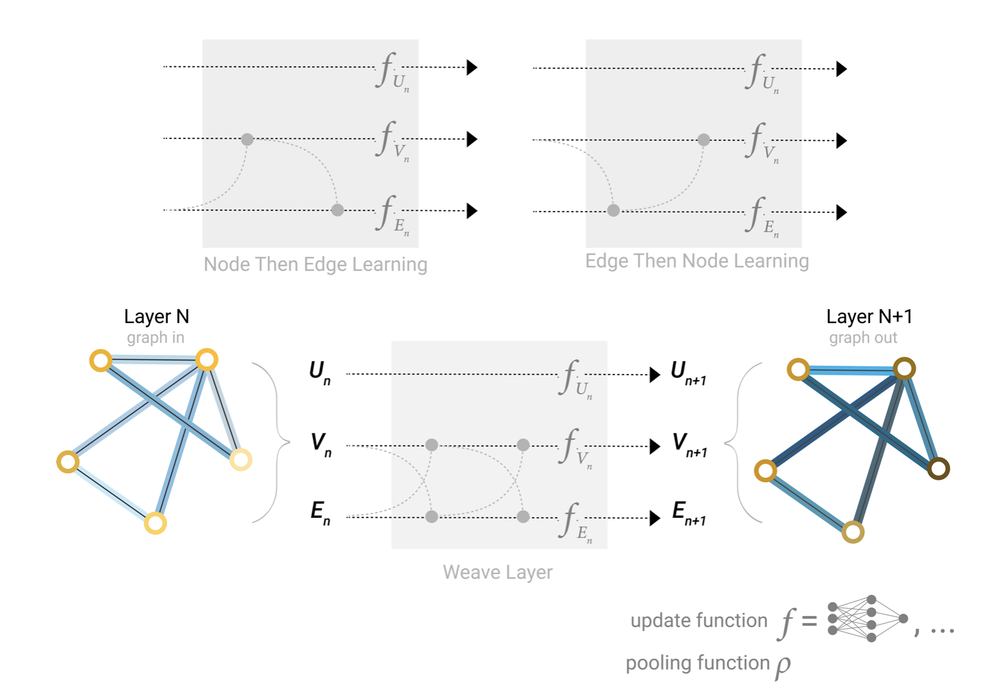
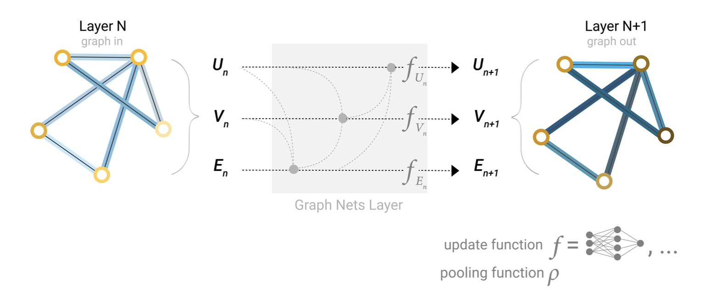

图作为数据的一种结构在现实世界中广泛存在，只要存在**实体（节点）和联系（边）**，都可以表示为图。

近几年来，GNN在有关于图的任务上表现出强大的能力。e.g. 病毒爆发、物理模拟、谣言传播、交通预测和推荐系统方面，都出现了实际的应用。

文章分四个部分来介绍：

1. 什么样的数据可以表示为图？
2. 图有什么不同之处？对应来说有哪些手段？
3. 从最基本的实现到sota的模型来介绍GNN model（从简单到复杂）
4. GNN playground实战演练

## 什么是图？哪里有图？有哪些问题？

图的信息包括：节点的属性、边的属性和方向、全局（或主节点）的属性。

虽然有些反直觉（并不觉得），图片和文字同样也可表示为图。

图可以将像素视作节点，8近邻视为其邻居，邻居间两两连边，就构成一张图。（不同通道之间怎么连？）

文本将字符、词或token视作节点，对其做one-hot编码，并根据序列的先后关系对相邻的连有向边，同样构成了一张图。（文本构成的语法树也是图）

实际上我们并不会像上面这么编码，图和文本的邻接矩阵表示成带状和对角线很规则的形状，这种表示方法是多余的。

但现实世界中，还有一些数据只适合表示成图的形式，e.g. 分子图（共价健）、社交网络、引文网络，其余如CV（将对象视作节点，关系视作边）、ML models、编程代码、数学公式（数据流图）。

现实世界中不同的图数据之间存在很大的差异，有些可能边少点多，而有些是点多边少。差别主要一下在节点和边的数量与节点之间的连接性（极值、平均 etc.）上。

图相关的预测问题可以分为三大类：图级别、节点级别、边级别。

- Graph-level task：预测整个图的性质
- node-level task：预测图内每个节点的身份/属性
- edge-level task：链接（有无）预测，或边的属性预测

## 图上机器学习的挑战

1. 如何表示图？机器学习接受矩阵作为输入，图的信息包括nodes、edges、global-context和connectivity。如何表示图的connectivity是很复杂的问题，可以考虑**邻接矩阵**，但它有一些缺点，对于**稀疏的邻接矩阵**它的空间$|V|*|V|$无疑是低效的。
2. 多个邻接矩阵对应于相同的connectivity（等价的），然而它们作为GNN的输入结果却不一致，这种表示不具有排列不变性(permutation invariant)。
3. 对于以上两个问题，**邻接表(Adjacency List)**解决了，它用于表示稀疏矩阵是优雅且memory-efficient的。

## GNN

首先明确，GNN是一种**可优化的(optimizable)的**、对图的所有属性（具有graph symmetries/排列不变性）的变换。GNN的搭建用的是**消息传递神经网络(message passing neural network)**的框架，输入是一张图，输出也是一张图，其中nodes, edges and global-context的embedding发生了转换，而connectivity是始终不变的。

接下来是如何从**最基本的实现**到**sota的模型**，展示逐步实现GNN model的过程：

- simplest GNN：只用graph attributes (nodes, edges, global)，暂时先把connectivity忽视。在这最简单的GNN中，nodes, edges, global的embedding学习是分开的，暂时不存在消息传递。

- 加入池化(Pooling)操作：分为两步，一是拼接所有要被池化的embeddings为一个matrix；二是将所有的embeddings聚合(aggregate)起来，可选的方法有sum、mean、max。在这一步中，nodes、edges、global的处理过程是独立的，只在最后一步把信息合并(Pooling)用于预测。池化操作在node classification的例子中是把边的embeddings传递给节点。但实际上可以非常灵活，nodes、edges、global之间都可以相互传递。
- 消息传递(Passing message)：GNN层中同样可以加入pooling操作，邻域的节点和边之间交换信息来更新embeddings。具体工作分为三步：收集(gather)邻域的embeddings；聚合(aggregate)信息；更新(pooling)消息，更新函数通常用NN。 该过程和图像上的卷积有相似性。通过堆叠(stacking)消息传递的GNN层，节点的感受野相当于跳了对应步数的范围。GCN就是根据一阶邻域池化来更新节点表示。

- 学习边表示：**在GNN层中加入边与节点之间的消息传递**，可以学习**节点空间到边空间**的**线性映射**，或简单地**拼接(concat)**在一起再用update function。至于更新图属性的选择和顺序就是在设计网络中决策的了。

- 加入全局表示：现有的方法只能聚合局部的信息，对于距离较远的节点之间无法消息传递。一种对小型网络行之有效的方法是，建立虚边(virtual edges)。但是对于大型网络，这种方法的计算消耗过于庞大，于是我们引入了全局表示(global representation/master node/context vector)的概念，它连接了网络中所有的边与节点，这极大丰富了网络学习表示的能力。

思考&总结：GNN其实可以一分为二，第一部分是用于学习节点/边/图的表示，第二部分是为具体任务（多分类/二分类/回归 etc.）而设计的。在学习图表示的部分，核心思想是aggregate，利用上节点、边、全局的信息；这时候涉及到向量维度不一致的问题，通常有简单concat、线性mapping、 feature-wise modulation layer etc.方法；而连接性（邻接矩阵/邻接表）是作为确定邻域而存在，它自始自终保持不变。

## 相关阅读

| 序号 | 标题                                                         |
| ---- | ------------------------------------------------------------ |
| 1    | [A Gentle Introduction to Graph Neural Networks](https://distill.pub/2021/gnn-intro/) |

